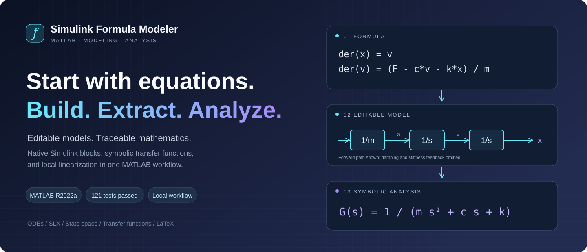
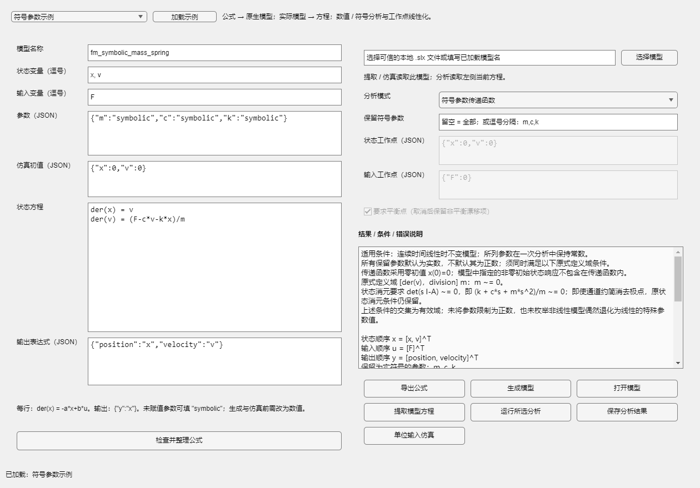
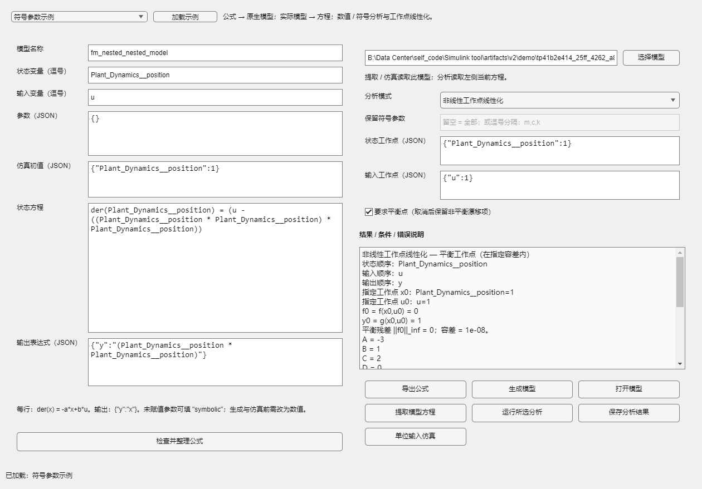

<p align="center"></p>
<h1 align="center">Simulink Formula Modeler · 公式建模</h1>
<p align="center"><strong>English</strong> | <a href="README.zh-CN.md">简体中文</a></p>
<p align="center"><strong>Start with equations. Build. Extract. Analyze.</strong></p>
<p align="center">A local MATLAB tool · Editable Simulink models · Symbolic transfer functions · Operating-point linearization</p>
<p align="center">
  <a href="https://github.com/Curlance/simulink-formula-modeler/releases/latest">Download ZIP</a> ·
  
  
  
  
</p>
<p align="center">
  <a href="https://github.com/Curlance/simulink-formula-modeler/releases/tag/v0.2.1">v0.2.1 Release</a> ·
  <a href="#preview">Preview</a> · <a href="#quick-start">Quick Start</a> ·
  <a href="#model-support">Model Support</a> · <a href="CHANGELOG.md">Release Notes (中文)</a>
</p>



Turn explicit first-order differential equations into editable native Simulink models, extract equations from supported models, export formulas, and analyze numerical or symbolic input-output relationships. Runs locally in MATLAB, with no Python installation or cloud service required.

This README is available in English and Chinese. The application interface, generated explanations, and detailed API guides are currently in Simplified Chinese.

## Features

| Workflow | Output |
| --- | --- |
| Equations → model | Editable native SLX, original JSON, and a MATLAB rebuild script |
| Model → equations | State equations from actual parameters, connections, and initial conditions, with source block paths |
| Formula export | Plain text, standalone Chinese LaTeX, and Markdown; independent of model generation |
| Numerical analysis | A/B/C/D matrices and SISO or MIMO transfer functions after verifying linearity |
| Symbolic analysis | Symbolic matrices, transfer-function channels, derivations, and domain conditions |
| Operating-point linearization | Analytical Jacobians, equilibrium residuals, and local small-signal models |
| Simulation | Unit constant-input responses compared with an independently integrated ODE |

## Requirements

| Dependency | Purpose |
| --- | --- |
| MATLAB, tested on R2022a | Interface, parsing, formula export |
| Simulink | Model generation, extraction, simulation |
| Control System Toolbox | Numerical transfer functions and linearization |
| Symbolic Math Toolbox | Symbolic-parameter transfer functions |
| XeLaTeX with ctex (optional) | Compile exported Chinese LaTeX to PDF |

Other MATLAB versions have not been verified. The full test suite requires all four MATLAB products above.

## Quick start

Download and extract the ZIP from [Releases](https://github.com/Curlance/simulink-formula-modeler/releases/latest), or clone:

```bash
git clone https://github.com/Curlance/simulink-formula-modeler.git
```

In the MATLAB Command Window:

```matlab
cd('path/to/simulink-formula-modeler'); % Replace with your downloaded path
launch;
```

Load an example using the example selector, check the equations, export formulas, or generate a model. Choose numerical, symbolic, or operating-point analysis and provide its required inputs.

Output defaults to `artifacts/exports`. Export operations reject existing files with the same name. After editing a model, extract its equations again; after editing equations, regenerate the model; rerun analysis when inputs change.

### MATLAB API

Run from the repository root:

```matlab
addpath(pwd);
raw = jsondecode(fileread('examples/mass_spring_damper.json'));
spec = fm.core.validateSpec(raw);
folder = tempname(fullfile(pwd, 'artifacts'));
modelPath = fm.simulink.generateModel(spec, folder);
open_system(modelPath);
result = fm.analysis.deriveTransferFunction(spec);
disp(result.system);
```

### Examples

| JSON specification | Demonstrates |
| --- | --- |
| [first_order.json](examples/first_order.json) | A single-state first-order system |
| [mass_spring_damper.json](examples/mass_spring_damper.json) | A second-order system written as two first-order equations |
| [coupled_states.json](examples/coupled_states.json) | Coupled state dynamics |
| [symbolic_mass_spring.json](examples/symbolic_mass_spring.json) | Symbolic parameters |
| [nonlinear_equilibrium.json](examples/nonlinear_equilibrium.json) | Nonlinear equilibrium linearization |

## Preview

Actual MATLAB application screenshots. The banner above is a workflow illustration.

**Symbolic-parameter transfer functions**



**Nonlinear operating-point linearization**



## Model support

Extraction supports continuous scalar basic blocks, nested ordinary virtual subsystems with multiple ports, local/scoped/global Goto/From routing, Terminator, SISO Transfer Fcn, and SISO multi-state State-Space blocks. A `sourceMap` links extracted equations to original block paths.

Unsupported structures produce errors with the full block path: atomic or controlled subsystems, variants, masked or library-linked blocks, model references, discrete and delay blocks, Mux/Demux, buses, vector interfaces, Stateflow, and Simscape. Equation-based MIMO analysis is supported; MIMO State-Space block extraction is unsupported. See the [support matrix (中文)](docs/model-support.md).

R2022a Transfer Fcn uses zero initial conditions in this workflow. Use State-Space for nonzero initial conditions.

## Analysis behavior and limits

- **Symbolic parameters:** assign a number or the exact string `"symbolic"`. Leave the retained-parameter field empty to retain all parameters; enter `m,k` to retain only those. Original division and power domain conditions survive simplification. Symbolic Jacobians and identity residuals prove linearity; unproven identities are conservatively rejected.
- **Linearization:** specify every state and input at the operating point. Equilibrium is required by default, and derivative residuals are reported. Explicitly permitting a nonequilibrium point returns an affine local expansion with drift, without a transfer function. Results are local small-signal approximations.
- **Expressions:** use explicit first-order ODEs. Rewrite second-order systems in state form; direct second-order implicit parsing is unsupported. Linearization supports differentiable real-domain expressions, with conservative handling of ambiguous fractional powers at zero.
- **Model loading:** use trusted models. MATLAB may execute callbacks when loading SLX files; the restricted expression parser does not sandbox model loading.

## Tests and verification

Run from the repository root in MATLAB:

```matlab
run('tests/runAll.m');
```

The release preparation run on MATLAB R2022a completed with **121 passed, 0 failed, 0 incomplete; process exit code 0**. See the [original summary](docs/evidence/release-summary.json), [per-test results](docs/evidence/release-results.csv), and [verification report (中文)](docs/verification-report.md).

Coverage includes parsing, validation, export, SLX generation and rebuilding, parameter and wiring changes, nested models and routing, numerical and symbolic analysis, linearization, independent ODE comparisons, cross-module workflows, and UI tests. Reports are saved to `artifacts/tests/<timestamp>/`; failed or incomplete tests fail the run.

The v0.2.1 update changes documentation and visual assets only; MATLAB source is identical to the tested v0.2.0 source. Generated output, caches, autosave files, and development backups are excluded from Git.

## Documentation

Detailed guides currently use Chinese:

- [Quick start](docs/quick-start.md) and [extended usage](docs/v2-guide.md)
- [Model support](docs/model-support.md) and [input-output analysis](docs/input-output-analysis.md)
- [Symbolic analysis](docs/symbolic-analysis.md) and [linearization](docs/linearization.md)
- [Verification](docs/verification-report.md), [release notes](CHANGELOG.md), and [contributing](CONTRIBUTING.md)

## License

No open-source license has been granted. Contact the owner before redistributing the software, publishing modified versions, or using it commercially.